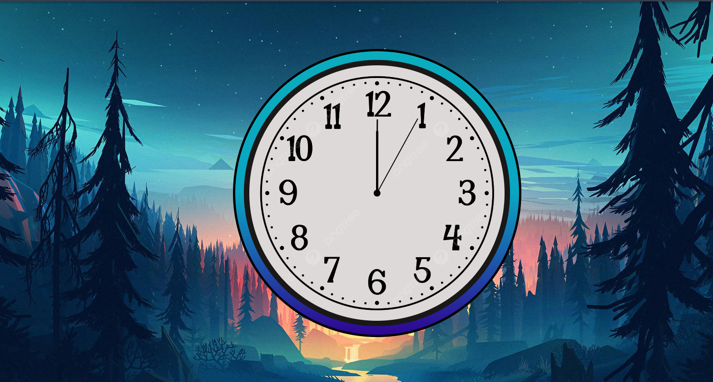

# Analog Clock
 An Analog Clock made with Html and Css
⏰ Analog Clock

Welcome to my Analog Clock project! 🕰️ This is a simple yet elegant clock built using HTML & CSS that dynamically represents real-time movement of the hour, minute, and second hands.

🎯 Features

🕒 Real-time working analog clock

🎨 Clean and modern UI design

📱 Responsive layout for different screen sizes

⚡ Pure HTML & CSS (No JavaScript required)

🖼️ Preview

🚀 Technologies Used

HTML5 🏗️

CSS3 🎨

📂 Folder Structure

📁 analog-clock
 ├── 📄 index.html  # HTML structure
 ├── 🎨 clock.css   # Styling for the clock
 ├── 📜 README.md   # Project documentation

🔧 Setup Instructions

Clone the repository:

git clone https://github.com/chinky29/analog-clock.git

Navigate to the project folder:

cd analog-clock

Open index.html in your browser and enjoy! 🎉

⭐ Show Some Love

If you like this project, don't forget to star ⭐ the repository!

Happy Coding! 🚀